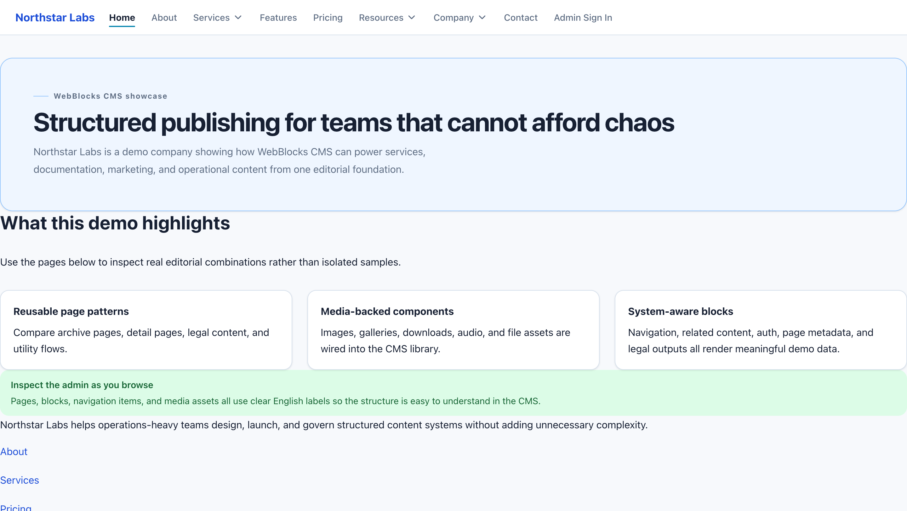
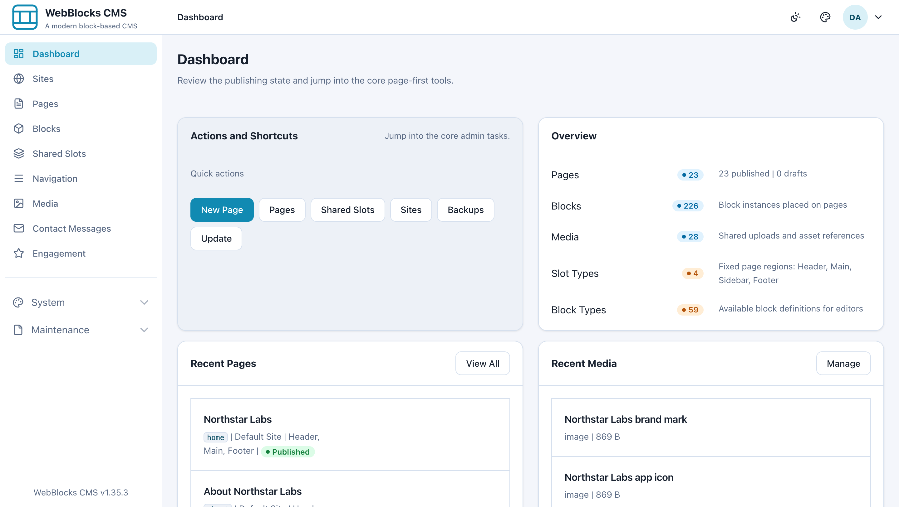
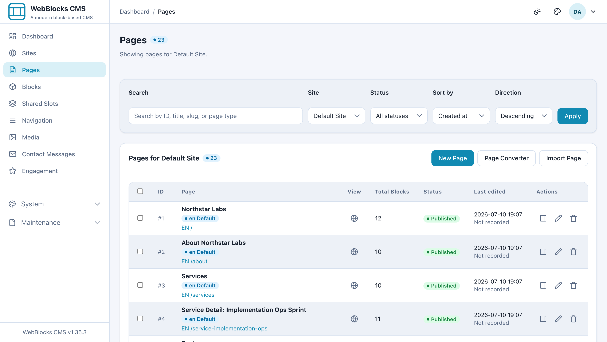

# WebBlocks CMS

> A Laravel-native, block-based CMS for building and operating multiple sites from one admin.

[](https://github.com/fklavyenet/webblocks-cms/actions/workflows/ci.yml)
[](LICENSE)


WebBlocks CMS lets you build pages from reusable blocks and manage sites, media,
navigation, and editorial publishing from a single admin. It ships with
install-level tools for users, updates, backups, and site transfer — and an
Internal Content API designed for AI and operator tooling.

It runs standalone, or alongside an existing Laravel app as an optional content
layer. There is **no Node/npm/Vite build step** — CMS assets are static, so
deployment stays simple on ordinary PHP hosting.

> **Positioning:** WebBlocks CMS is best described as a *Laravel-native operator
> CMS* for multisite content operations, controlled public rendering, and
> AI-assisted page workflows — not a WordPress replacement or a headless
> delivery platform. See the [Product Maturity Assessment](docs/product-maturity-assessment.md).

## Screenshots



*A public page rendered from blocks — navigation, hero, and a feature grid, all editable in the admin.*



*The operator dashboard — publishing state, quick actions, and recent content at a glance.*



*Multisite page management with search, filters, block counts, and per-page actions.*

<!-- TODO: add a live demo link once the public demo is deployed to a host. -->

## Highlights

- 🧱 **Block-based pages** — reusable layouts, slots, and blocks; draft → review → publish workflow with page revisions and restore.
- 🌐 **Multisite & multi-domain** — locale-aware pages, per-site domains/aliases, themes, and site-scoped CSS/JS.
- 🖼️ **Media & navigation** — media library, site-scoped navigation menus, shared slots for reusable block trees.
- ✉️ **Native content blocks** — spam-aware contact forms, site search, ratings and comments — no third-party embeds.
- 💾 **Operations built in** — backups & restore, export/import, site clone, site promotion, and in-app package-native updates.
- 🔌 **Plugins** — install signed plugin ZIPs (disabled by default), browse a plugin catalog, plus a first-party **WebBlocks Commerce** plugin.
- 🤖 **AI/operator API** — a token-protected Internal Content API to discover contracts and validate/apply draft-first content plans.
- ⚡ **Simple to run** — Laravel 13, static assets, no frontend build chain.

See the [Feature Inventory](docs/feature-inventory.md) for the complete list.

## Requirements

- PHP **8.4+**
- Composer 2
- A database: SQLite, MySQL, or MariaDB
- A web server with the document root pointing at `public/`

## Quick start

### Try it in 60 seconds (Docker)

The fastest way to explore the CMS — no PHP, Composer, or database setup:

```bash
git clone https://github.com/fklavyenet/webblocks-cms.git
cd webblocks-cms
docker compose up --build
```

Then open **http://localhost:8080** and sign in at **/webadmin** with
`admin@example.com` / `password`. It installs itself (SQLite) on first boot.
This is a demo, not a production setup.

### Install locally with the browser wizard

Try it locally with the browser install wizard:

```bash
git clone https://github.com/fklavyenet/webblocks-cms.git
cd webblocks-cms
git remote set-url --push origin DISABLED   # installs are update consumers, not publishers

composer install
cp .env.example .env
php artisan key:generate
php artisan serve
```

Then open **http://127.0.0.1:8000/install** and follow the wizard. When it
finishes, sign in at **/webadmin**.

### Install into an existing Laravel app

```bash
composer require fklavyenet/webblocks-cms
php artisan webblocks:install --name="Admin User" --email="admin@example.com" --password="secret-password"
```

Both paths — and production notes — are covered in **[Installation](docs/installation.md)**.

> **Security:** serve only `public/` as the web root. `.git` and `.github` must
> never be web-reachable (a request to `/.git/config` should return 404). Prefer
> deploying a release artifact over a raw git clone in production.

## Documentation

Start here:

- [Getting Started](docs/getting-started.md) · [Installation](docs/installation.md) · [Core Concepts](docs/core-concepts.md)
- [Feature Inventory](docs/feature-inventory.md) · [Multisite](docs/multisite.md) · [Localization](docs/localization.md)
- [Editorial Workflow](docs/editorial-workflow.md) · [Revisions](docs/revisions.md) · [Users & Permissions](docs/users-and-permissions.md)
- [Page Layouts](docs/page-layouts.md) · [Block Type Contracts](docs/block-type-contracts.md) · [Public Assets](docs/public-assets.md)
- [Search](docs/search.md) · [Contact Forms & Messages](docs/contact-forms-and-messages.md) · [Operations](docs/operations.md) · [Updates](docs/updates.md) · [Security](docs/security.md)

For AI / operator tooling:

- [Internal Content API](docs/internal-content-api.md) · [API Discovery](docs/api-discovery.md) · [AI Page Building Guide](docs/ai-page-building-guide.md)

For maintainers and contributors:

- [Development Workflow](DEVELOPMENT.md) · [Architecture Decisions](ARCHITECTURE_DECISIONS.md) · [AGENTS.md](AGENTS.md)
- [Detailed Project Reference](docs/project-reference.md) — the former long-form README (feature notes, conventions, release details).

The full docs index lives in [`docs/`](docs/).

## Project status

WebBlocks CMS is actively developed and used in production on the maintainer's
own sites. It is open source and free. See the
[Product Maturity Assessment](docs/product-maturity-assessment.md) for an honest,
dated view of where it is strong (Laravel-native install/update, multisite,
operator/AI workflows) and where it is still maturing (editor onboarding,
ecosystem, buyer-facing docs).

## Contributing

Contributions are welcome — see **[CONTRIBUTING.md](CONTRIBUTING.md)** and the
[Code of Conduct](CODE_OF_CONDUCT.md). Run `composer test` and
`composer format:test` before opening a pull request.

## Security

Read the [Security guide](docs/security.md) for the security model and production
hardening (web-root, update integrity, tokens, deployment). Please report
vulnerabilities privately — see **[SECURITY.md](SECURITY.md)**. Do not open public
issues for security reports.

## License

WebBlocks CMS is open-source software licensed under the [MIT license](LICENSE).

## Trademark

"WebBlocks CMS" and its logos are the property of Fklavyenet, which operates
<https://fklavye.net>. You may use, modify, and distribute the code under the MIT
license, but you may not use the "WebBlocks CMS" name or logos for derived
products without permission. If you fork or redistribute this project, remove or
replace all branding.
