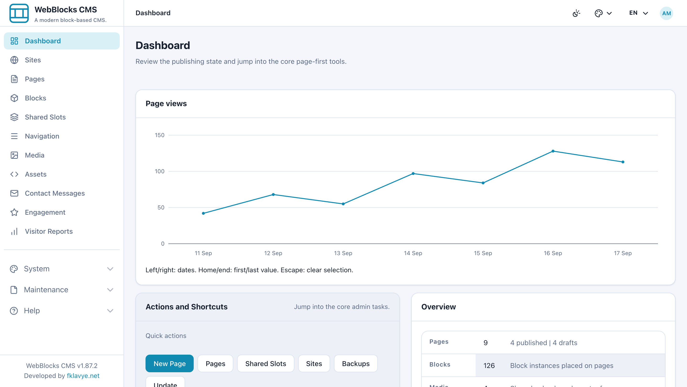
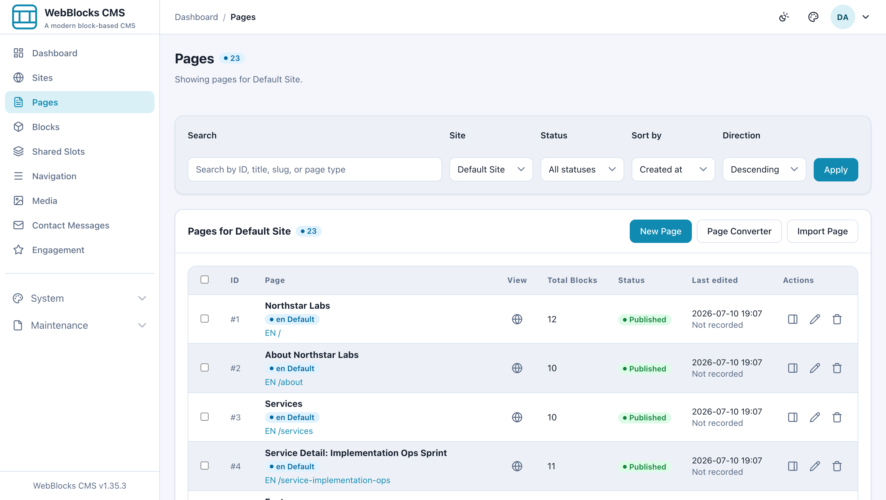

# WebBlocks CMS

**A modern block-based CMS.**

[](https://github.com/fklavyenet/webblocks-cms/actions/workflows/ci.yml)
[](https://packagist.org/packages/fklavyenet/webblocks-cms)
[](https://packagist.org/packages/fklavyenet/webblocks-cms)
[](composer.json)
[](composer.json)
[](LICENSE)

WebBlocks CMS is a modern block-based CMS for content operations across multiple sites and locales. It adds structured pages, media, navigation, editorial workflows, and an operator admin under `/webadmin` to a host Laravel application.

> [!IMPORTANT]
> This repository is Composer package source, not a complete deployable Laravel application. Install `fklavyenet/webblocks-cms` into a host Laravel 13 application; the host continues to own its bootstrap, `.env`, database, queues, mail, deployment, backups, and public document root.



_The operator dashboard brings publishing state, common actions, recent pages, and media into one package-owned admin._

## What WebBlocks CMS provides

- **Block-based publishing** — reusable page layouts, slots, nested blocks, drafts, review, publishing, revisions, and restore.
- **Multisite and localization** — multiple sites, domains, locales, translated content, and site-scoped navigation and presentation.
- **Media management** — a shared Media Library, responsive image variants, focal-point-aware crops, metadata, folders, and usage guards.
- **Reusable content** — Shared Slots, navigation trees, block catalogs, native Stack/Split/Cluster/Grid layout composition, and package-owned public renderers built on WebBlocks UI classes.
- **Operator workflows** — users and permissions, search, contact messages, engagement, backups, site transfer, cloning, and package-native updates.
- **Trusted automation APIs** — capability-scoped Internal Content APIs for discovery, validation, draft-first page building, media, and publishing workflows.
- **Static package assets** — no Node, npm, Vite, or frontend build chain is required by the CMS package.



_The Pages listing combines site and status filters with publishing state, block counts, previews, and page actions._

## Requirements

- PHP `^8.4`
- Laravel Framework `^13.0`
- Composer 2
- PHP extensions: `mbstring`, `sodium`, and `zip`
- A database supported by the host Laravel application
- Optional: GD for CMS image and media transformations

The supported ranges come from [`composer.json`](composer.json). CI runs the package suite, a current Laravel 13 consumer installation, a Laravel `13.0.*` resolution-floor check, distribution validation, and documentation checks.

## Installation

Start with a fresh or existing Laravel 13 host whose application key and database are configured. The normal host `App\Models\User` model must exist and be writable during initial CMS setup.

```bash
composer require fklavyenet/webblocks-cms

php artisan webblocks:install \
  --name="Admin User" \
  --email="admin@example.com" \
  --password="use-a-strong-password"
```

Laravel discovers `WebBlocks\Cms\WebBlocksCmsServiceProvider` through the package manifest. The idempotent install command:

- publishes missing CMS configuration and static assets;
- patches the host User model with CMS access behavior;
- removes only Laravel's untouched welcome route;
- installs the package-owned schema and required Laravel support tables;
- prepares storage and seeds the core CMS catalog; and
- creates the first site and super administrator.

Review [Hosting Requirements](docs/hosting-requirements.md), the qualification method in [Hosting Capacity Validation](docs/hosting-capacity-validation.md), the explicitly provisional [Hosting Capacity Results](docs/hosting-capacity-results.md), and the [Hosting Readiness Checklist](docs/hosting-readiness-checklist.md) before provisioning production hosting. Current measurements are workload evidence, not a production-certified universal minimum. Review [Installation](docs/installation.md) before using repair options or integrating with an application that already has data. For route and user-identity boundaries in an existing product, see [Laravel coexistence](docs/coexistence.md).

## Host integration

The host remains the application boundary. It owns authentication decisions outside the CMS, environment configuration, database connectivity, scheduled work, mail and queue drivers, deployment, and backups. WebBlocks CMS uses the host User identity and adds CMS membership and role authorization; host product administrators are not automatically CMS administrators.

After installation, open `/webadmin`. Package-owned CMS authentication uses `/webadmin/login` unless the host intentionally supplies an integrated authentication flow. `/cms` is reserved for published static assets and is not an admin prefix.

## Configuration and assets

The package supports these publish tags:

```bash
php artisan vendor:publish --tag=webblocks-cms-config
php artisan vendor:publish --tag=webblocks-cms-assets
php artisan vendor:publish --tag=webblocks-cms-stubs
```

Views, translations, and migrations load from the installed package and do not have separate publish tags. Avoid `--force` unless you intentionally want to replace package-owned published files in a controlled host environment.

CMS static assets are published under `public/cms`. Site-owned overrides belong under `public/site/{site_handle}` in the host application. See [Public assets](docs/public-assets.md), [public themes and tones](docs/public-theme-and-tones.md), and [media image variants](docs/media-image-variants.md).

## Package development

This repository is directly package-rooted. For package development:

```bash
composer install --no-interaction --prefer-dist
composer validate --strict
composer check-platform-reqs
composer format:test
composer test
```

Additional package checks are available as `composer test:consumer`, `composer test:dist`, `composer test:docs`, and `composer test:floor`. See [CONTRIBUTING.md](CONTRIBUTING.md) and the [package testing strategy](docs/testing-strategy.md).

## Upgrading

WebBlocks CMS `1.37.0` is the first release tagged from the package-only repository root. The package identity remains `fklavyenet/webblocks-cms`; the repository transition does not turn this source tree into a standalone Laravel application.

Existing full-repository clones must preserve host-owned `.env`, database, storage, uploads, plugins, project content, application files, and public overrides. Do not pull the package-only tree across a historical full-application checkout. Follow [UPGRADING.md](UPGRADING.md) for Composer, legacy clone, source-maintained, and Publisher/System Updates topologies.

## Documentation

- Use the canonical product name, slogan, and package description from [Brand identity](docs/brand-identity.md).
- Start with [Hosting Requirements](docs/hosting-requirements.md), [Hosting Capacity Validation](docs/hosting-capacity-validation.md), the provisional [Hosting Capacity Results](docs/hosting-capacity-results.md), [Installation](docs/installation.md), [Getting Started](docs/getting-started.md), and [Core Concepts](docs/core-concepts.md).
- Build content with [Page Layouts](docs/page-layouts.md), [Block Type Contracts](docs/block-type-contracts.md), [Editorial Workflow](docs/editorial-workflow.md), and [Revisions](docs/revisions.md).
- Operate sites with [Multisite](docs/multisite.md), [Localization](docs/localization.md), [Users and Permissions](docs/users-and-permissions.md), [Media Image Variants](docs/media-image-variants.md), and [Operations](docs/operations.md).
- Integrate trusted tools through the [Internal Content API](docs/internal-content-api.md), [API Discovery](docs/api-discovery.md), and [AI Page Building Guide](docs/ai-page-building-guide.md), and check [API and Panel Alignment](docs/api-panel-alignment.md) for what the API deliberately does not cover.
- Understand runtime boundaries in [Package Architecture](docs/package-architecture.md), [Laravel Coexistence](docs/coexistence.md), [Plugin System](docs/plugin-system.md), and [Updates](docs/updates.md).
- Read planned work in the [Appointments Plugin Plan](docs/appointments-plugin-plan.md), which is a design record rather than shipped behavior.

## Security

Do not disclose vulnerabilities in public issues. Follow [SECURITY.md](SECURITY.md) for private reporting and read the [security guide](docs/security.md) for host hardening, authorization, token, upload, and update-integrity boundaries.

## Contributing and support

Contributions are welcome through [CONTRIBUTING.md](CONTRIBUTING.md) and the [Code of Conduct](CODE_OF_CONDUCT.md). Use the [issue tracker](https://github.com/fklavyenet/webblocks-cms/issues) for reproducible bugs and feature requests. [SUPPORT.md](SUPPORT.md) explains support boundaries and the distinction between public support and private security reports.

## Acknowledgements

WebBlocks CMS is designed, directed, and maintained by Osman Bozdağ.

Development has been supported with AI-assisted engineering, primarily
through OpenAI ChatGPT, with limited contributions from Anthropic Claude.

## License

WebBlocks CMS is open-source software licensed under the [MIT License](LICENSE).
